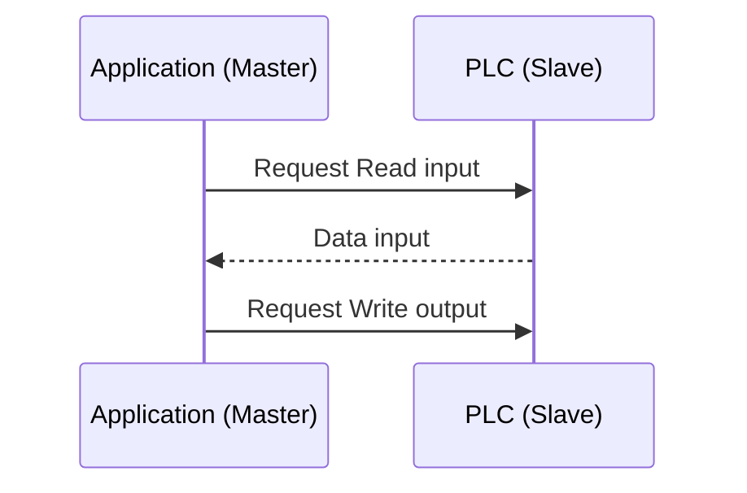
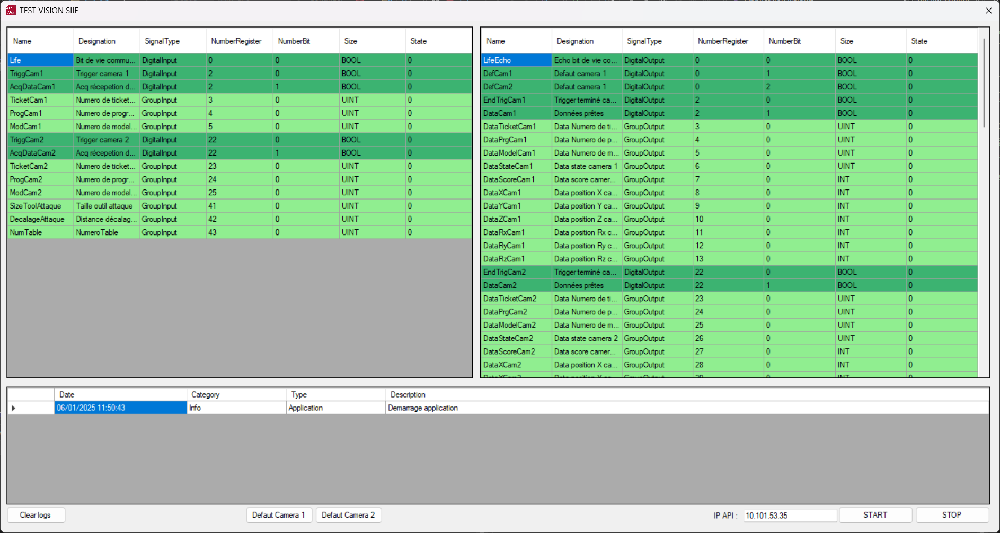

<a id="readme-top"></a>

# ModbusCommunication

ModbusCommunication est une librairie C# qui encapsule la librairie ➡️[Nmodbus](https://github.com/NModbus/NModbus) et ajoute une fonctionnalité de lecture/écriture cyclique.


<!-- APP -->
<div align="center">
    
</div>

> [!WARNING]
> Uniquement testé avec un automate M580 Schneider

## 1 - Exemple

Contructeur :
  ```C#
    mb = new ModbusTCPMaster(ip, port, startInput, 120, startOutput, 120);
    //Définition des entrées digital 
    mb.AddSignalInput(new DigitalInputSignal("Life", "Bit de vie communication", 0, 0));

    //Définition des sorties digital
    mb.AddSignalOutput(new DigitalOutputSignal("LifeEcho", "Echo bit de vie communication", 0, 0));
    mb.AddSignalOutput(new DigitalOutputSignal("DefCam1", "Defaut camera 1", 0, 1));
    mb.AddSignalOutput(new DigitalOutputSignal("DefCam2", "Defaut camera 1", 0, 2));
```

Evennement et écriture :
 ```C#
  //Bit de vie communication
	mb["Life"].SignalChanged += (s) =>
	{
	  mb["LifeEcho"].State = s.State;
	};
```

## 2 - AMELIORATION A FAIRE


## 3 - INFORMATION
> [!NOTE]
> L'application utilise ➡️[Nmodbus](https://github.com/NModbus/NModbus) pour communiquer avec l'automate M580 Schneider.

<p align="right">(<a href="#readme-top">Back to top</a>)</p>
